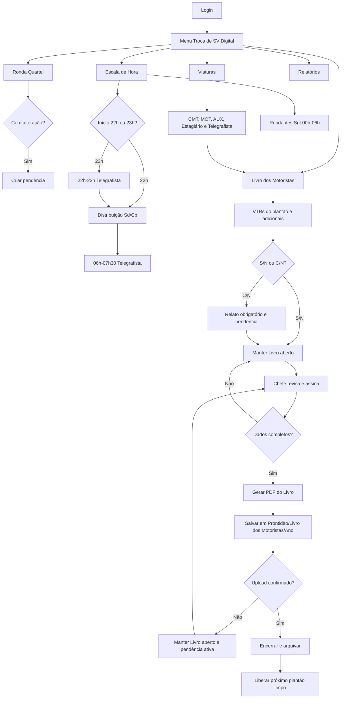

# Fluxograma - CD Digital

```mermaid
flowchart TD
  A["Login"] --> B["Menu Troca de SV Digital"]
  B --> C["Viaturas"]
  C --> D["CMT, MOT, AUX, Estagiário e Telegrafista"]
  B --> E["Ronda Quartel"]
  E --> F{"Com alteração?"}
  F -- "Sim" --> G["Criar pendência"]
  B --> H["Escala de Hora"]
  H --> I{"Início 22h ou 23h?"}
  I -- "23h" --> J["22h-23h Telegrafista"]
  I -- "22h" --> K["Distribuição Sd/Cb"]
  J --> K
  K --> L["06h-07h30 Telegrafista"]
  H --> M["Rondantes Sgt 00h-06h"]
  B --> N["Livro dos Motoristas"]
  D --> N
  N --> O["VTRs do plantão e adicionais"]
  O --> P{"S/N ou C/N?"}
  P -- "C/N" --> Q["Relato obrigatório e pendência"]
  P -- "S/N" --> R["Manter Livro aberto"]
  Q --> R
  R --> S["Chefe revisa e assina"]
  S --> T{"Dados completos?"}
  T -- "Não" --> R
  T -- "Sim" --> U["Gerar PDF do Livro"]
  U --> V["Salvar em Prontidão/Livro dos Motoristas/Ano"]
  V --> W{"Upload confirmado?"}
  W -- "Não" --> X["Manter Livro aberto e pendência ativa"]
  X --> S
  W -- "Sim" --> Y["Encerrar e arquivar"]
  Y --> Z["Liberar próximo plantão limpo"]
  B --> AA["Relatórios"]
```

O Cabo de Dia pode revisar as sugestões automáticas antes das assinaturas. A OD permanece informativa e não entra automaticamente na escala de hora ou na ronda.
